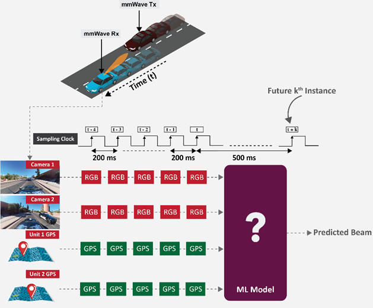

# Multi Modal V2V Beam Prediction Challenge
This repository contains the proposed solution of Team Beamwise for [`Multi Modal V2V Beam Prediction Challenge 2023`](https://www.deepsense6g.net/beam_prediction_challenge_2023/)

## Problem Statement
The objective of the challenge is to design a machine learning (ML) solution that takes a sequence of 5 samples of 360 degrees camera and GPS data of two vehicles, to predict the optimal beam index 500 ms ahead. 



Figure 1: Schematic input sequences description.

## Solution
The developed transformer-based model is illustrated in Figure 2. We trained the model with cross entropy loss function, cyclic cosine learning rate scheduling, and exponential moving
average to improve the model’s robustness. For image augmentation, a random transformation is selected with an equal probability between different options, such as brightness, contrast, saturation, gamma, and blur. Image and GPS features are fused with pre-trained SWIN transformers. Training results shows that our proposed model effectively learns beam prediction in different scenarios.


Figure 2: Transformer-based Multi-Modal Sensing assisted Beam Prediction Model


## How to Reproduce the Results
We augment the development dataset by applying random transformations in the images. Since the transformations are performed during training, there is no extra data to download.
To reproduce the results it is necessary only the dataset provided by the ITU V2V Beam Prediction Challenge through the following link: [`ITU Challenge`](https://challenge.aiforgood.itu.int/match/matchitem/90)

The dataset and pretrained model are structured as follows:
```
- beamwise_project
    - Dataset
        - Multi_Modal
        - Multi_Modal_Test
    - log
        - train_effnet_b3_swin
            -model.pth
            -args.txt
        ...
```

## Training and Evaluation
The framework can be experimented with different approaches and hyperparameters for training and data preprocessing. The configurations and descriptions can be viewed as follows:
```
python main.py --help
```
The core code of our solution can be found in the following scripts:

* [`main.py`](./train2_seq.py): main code to train and test the developed model.
* [`model_efnetb3_swin.py`](./model_efnetb3_swin.py): transformer-based beam prediction model.
* [`load_data.py`](./load_data.py): data preparation for training and evaluation.
* [`config.py`](./config.py): configuration of main simulation parameters.

An example of how to run the training script to reproduce our best submitted model: 
```sh
python main.py --device cuda --epochs 20 --lr 1e-3 --loss ce --scheduler 1 --Test 0 --augmentation 1 --batch_size 26 --id train_effnet_b3_swin
```
To test a pre-trained model run the following command:
```sh
python main.py --logdir log --device cuda --loss ce --scheduler 0 --Test 1 --augmentation 0 --batch_size 10 --id train_effnet_b3_swin
```
Our best solution is saved in [`beamwise_prediction.csv`](./beamwise_prediction.csv).

## Reference
* [SWIN Transformer](https://github.com/microsoft/Swin-Transformer): Pre-trained transformer utilized for fusing features.
* [DeepSense6G_TII](https://github.com/ITU-AI-ML-in-5G-Challenge/DeepSense6G_TII/tree/main): We got inspiration by this repository.
